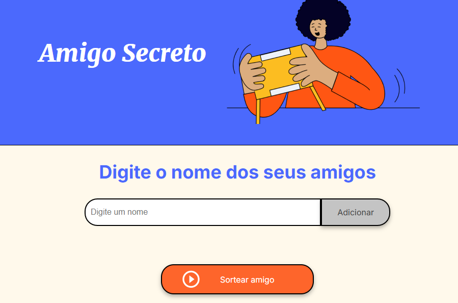
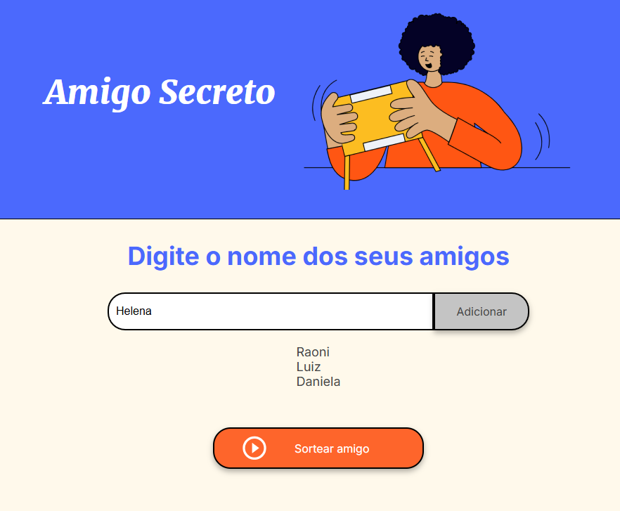
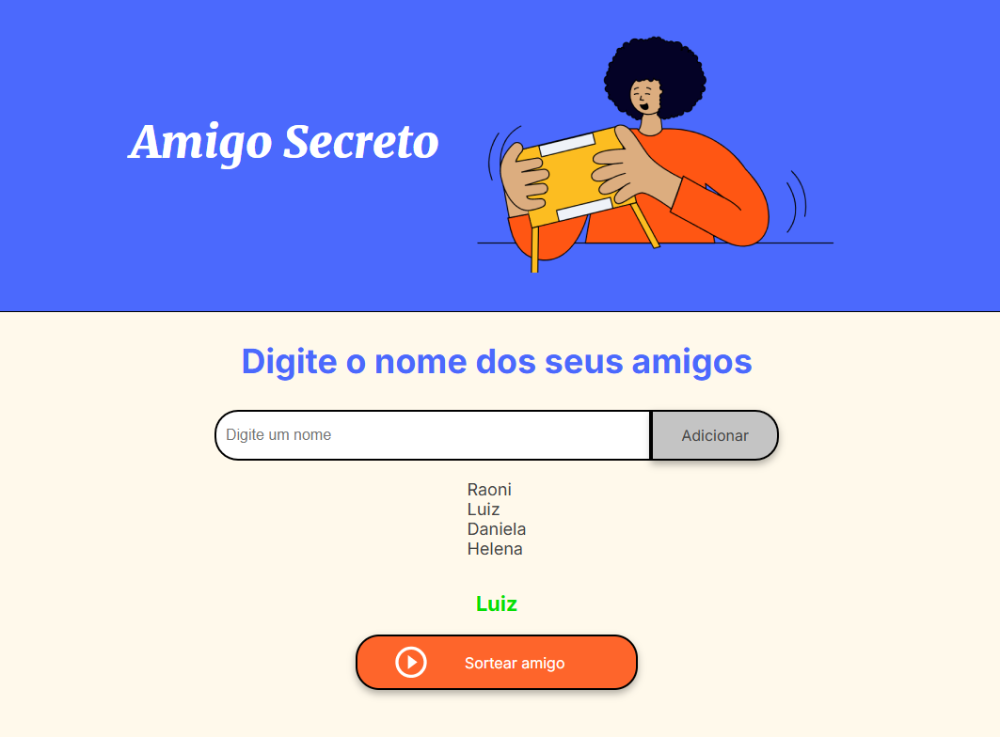
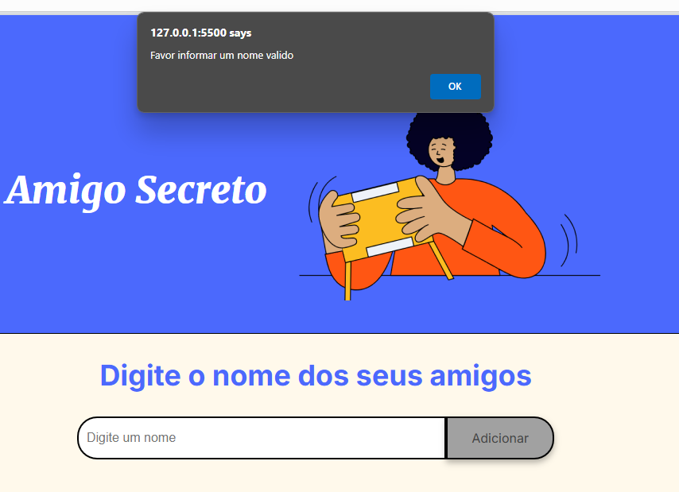
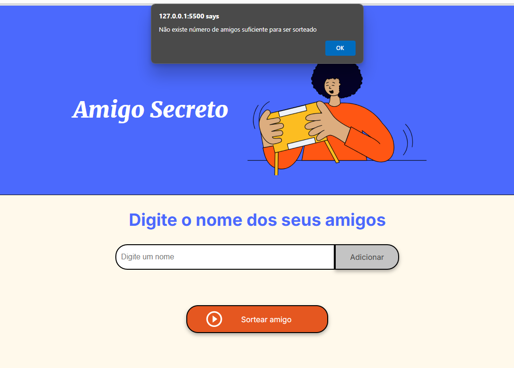

# CHALLANGE AMIGO SECRETO - PROGRAMA ONE

## Sobre:

Este projeto é um simples site para cadastro de lista de amigos para sortear um amigo secreto. Desenvolvido em JavaScript, ele permite que os usuários adicionem nomes à lista e realizem o sorteio de forma automática, garantindo uma experiência divertida e eficiente para organizar um amigo secreto.

## Funcionalidades

- Cadastro de Amigos: Adicione os nomes dos participantes diretamente na interface do site.

-   Validação de Dados: Evita campos vazios.

-   Sorteio Automático: Sorteia o nome do seu amigo secreto.

-   Interface Simples: Um design intuitivo para facilitar o uso por qualquer pessoa.


## Tecnologias Utilizadas

-   HTML: Estrutura da página.

-   CSS: Estilização e responsividade.

-   JavaScript: Lógica para cadastro e sorteio.

## Como Usar

Clone este repositório:

    git clone git@github.com:LacrouxRaoni/one_desafio_amigo_secreto.git

Abra o arquivo ```index.html``` em qualquer navegador de sua preferência.

Adicione os nomes dos participantes e clique em ```Adicionar```.

Quando a lista estiver completa, clique em ```Sortear amigo``` para visualizar o amigo secreto.

## Visualização da Página







